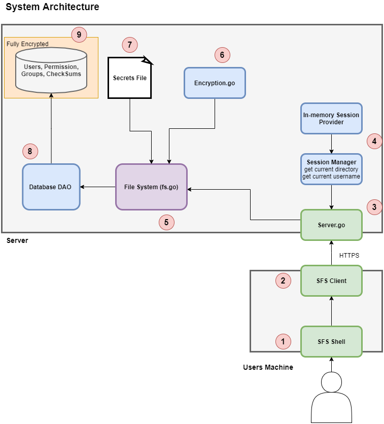

## Project 1: Secure File System

## 4 System Design

The figure below outlines the high level system designof the SFS, with components
enumerated to help with the following discussion.In this section we will discuss each
component in detail and touch on how they were designed with security in mind, and how they
could be improved. Please refer back to this image at any time for context. Note that the server
runs in a Cyber Cloud virtual machine running Ubuntu,and the client runs on the users
machine.

 

### 4.1 SFS Shell

The SFS Shell component is implemented in a singleton go file, and holds all of the
logic and functionality necessary to interpret, validate and execute user commands. The
execution of user commands is done by calling methods on the **SFS Client**. The shell is
simply an infinite loop that accepts, parses, validates,and responds to a line of input.
When the shell identifies the desired operation and arguments, they are passed to the

### 4.2 SFS Client

The SFS Client is simply a wrapper around the SFSAPI. It is capable of
interacting with all of the REST API’s endpoints,managing authentication states in the
client, and formatting requests, and cookies. Partof the communication flow involves
passing a cookie containing a session ID in each request after the client is
authenticated. The client helps make this possible.The client is also responsible for the
first layer of username and password encryption. The designs state that the
communication should be implemented over HTTPS such that all in-transit data is
secured with TLS. This is essential so the sessionid cannot be hijacked. Unfortunately
we were only able to implement it in HTTP with thetime constraints, which is a large
security flaw that should be fixed in the future.

### 4.3 Server

The server component of the system is responsiblefor coordinating the
communication between the file system and any connectedclient applications. It
contains several HTTP endpoints, one for each commandthat the file system supports,
plus several endpoints for administrative operationssuch as signing up users and
logging them in. The server and client communicationis organized in a session token
pattern. This communication protocol is describedin _figure 2._

First, the client application makes a POST requestto the login endpoint with an
HTTP body containing the users encrypted usernameand password. The user is then
authenticated using the passed credentials, and returneda 200 response request also
containing an HTTP cookie containing a generated sessionID. The client can then use
that sessionID in future requests, bypassing the needfor authentication. Finally, after
one (1) hour, the server deems the session expired,and the client prompts the user to
reauthenticate.

.png)
```
figure 2
```
This model presents several security vulnerabilitiesincluding **session hijacking.**
This form of attack however can be mostly mitigatedby countermeasures like setting
the HTTP header HTTP_ONLY to true, which preventsaccess to the cookie by any
parties not at the destination address. Also, usingHTTPS would ensure that any of the
data being passed is fully encrypted.


By combining the session data provided by the **sessionprovider** (see next
section) with the command arguments passed by theclient through HTTP requests, the
server is able to properly call functions of the **filesystem** and report their results back
to the client.

### 4.4 Session Manager and Provider

Sessions have certain data associated with them thatmust be referenced and
used for executing operations requested by users thatare signed in. That data includes
username and current working directory of the userin the session, and is stored within
the **session provider**. Access to the session providerfor a specific user is controlled by
the **session manager**. The session manager is definedwithin its own package and
used within the server as a singleton, protected bya mutex for access serialization. It
contains methods for getting the session providerfor an associated session ID, garbage
collecting old session providers, and creating newsession providers for new sessions.
New sessions are allocated a session object and arandom base64 encoded hash to
serve as it’s session ID. The session provider containsmethods for setting and getting
key value pairs defining data relevant for the session.As mentioned earlier, this data
includes username and current working directory ofthe session. The session provider is
effectively an in-memory cache for data related tothe session. [3]

The alternative to storing session data in an in-memorycache would have been
to have the client pass the current directory andusername on every request, however
that introduces vulnerability to attacks in whichthe client modifies its current working
directory or username dynamically during a session,in an attempt to gain access to files
for which it has no permission. By keeping the stateof the session completely internal,
the number of attack vectors is reduced substantially.

### 4.5 File System (FS)

The file system is a seperate Go package that consistsof a set of functions, each
representing some operation of the file system thatcan be executed using the local
operating system. By implementing the FS as a separatepackage, we were able to
decouple the file system logic from the communicationlogic of the server, or the
database communication logic of the DAO. Each functionin general accepts the
username of the current session owner, and the currentdirectory. In this way, the file
system package was able to be implemented as a stateless,functional way, reducing
the complexity and thus chance of bug introduction.Using the combination of
username, current directory and command arguments,the FS is able to verify user


permissions (using the DB) and execute the desired commands using the local os Go
package. The filesystem layer also enforces encryptionof all files, directories,
usernames and passwords using the **encryption** packageBEFORE they are stored in
the database. The FS functions will return errorsif permission is denied or something
goes wrong, which can then be caught and handled bythe server, promoting a
consistent error reporting / messaging interface forthe client.

```
figure 3 (excerpt from UML)
```
### 4.6 Secrets File

The secrets file is used to hold the encryption keysbeing used by the file system
for encryption of all data. It is loaded into memoryby the encryption module on start up.
Obviously this presents significant security risks,as an external user of the file system
server could gain access to the encryption keys. Amore robust solution would be to use


an externally mounted disk partition with sole access owned by the file system server
user, or even a dedicated hardware device.

### 4.7 Encryption

The encryption module contains various functionsused for the cryptographic
operations including AES data encryption / decryption,and SHA-256 Checksum
calculation. It is used by the FS to validate thechecksums of all of a user's files on login
and report discrepancies to the user, as well as encryptall users data and file contents.
The encryption is carried out using an AES block cipherin Galois Counter Mode (GCM)
with a constant nonce. The use of a constant nonceas opposed to a randomly
generated nonce certainly reduces the effectivenessof the encryption, but has the
added benefit of preserving data equality comparisons,even in encrypted form. This
always allows the FS to compare for example the providedpassword with the encrypted
password without needing to decrypt the password in-memory.

### 4.8 Database DAO

The database DAO is an implementation of the DataAccess Object (DAO)
pattern, which enables the data access logic to bedecoupled from the main logic of the
file system. The DAO exists in the system as a singletonthat is instantiated on
initialization of the filesystem, ensuring that dataaccess is serialized even among
parallel requests to the server by different users.The DAO makes use of many sql
query string templates to execute, select, insert,and update queries with the data
passed to them by the FS as needed. The DAO is alsoresponsible for running the
database initialization script on server startup,as well as creating and maintaining

### 4.9 Database

```
4.9 Database
```
The Database was implemented as an SQLite DB consistingof 5 tables, as
shown in the below ER diagram of _figure 4_. The databaseis simply stored locally on the
ubuntu BM in a file called sfs.db, and is recreatedevery time the server is restarted for
ease of development and demonstration. The SQLiteis capable of handling multiple
connections at the same time, however our system serializesaccess to the DB by
locking the database DAO with a mutex. Any data thatis stored on disk is **guaranteed**
to be encrypted, because the FS encrypts prior tostorage.


## 5 Deployment instructions

The SFS system consists of two separate pieces ofsoftware running in two separate
locations. The sfs server is to be deployed to a CyberCloud Ubuntu VM, while the SFS Shell is
to be run locally on the machine of any user. Thedeployment instructions below have been split
into two sections, the first describes setting upand running the client, and the second describes
deploying and running the server.


### 5.1 SFS Shell Deployment

To deploy the SFS Shell, ensure that the source codeis loaded onto your local
machine. To do so you can either download the code,or pull it from the Github
repository. Once the source code is available:

1. Open the root folder of the project in the terminal.
2. Ensure that the Go CLI and compiler is installed onyour machine. For references
   help seehttps://golang.org/doc/install. You can verifythis by running:
   **go --version**
3. Navigate to the **shell** directory
4. If not using our cloud VM host, change client.go line10 to new hostname.
5. Run:
   **go build shell.go**
   This should generate an executable file called **shell** or **shell.exe** if running on a
   Windows system.
6. Ensure that you have execution permissions on theexecutable. If not, add them.
7. Execute the shell using:
   **./shell**

### 5.1 SFS Server Deployment

To deploy the SFS Server, ensure that the sourcecode is loaded onto the server
that you wish to deploy to. You can do this by remotinginto the Cloud VM using SSH
and cloning the git repository directly onto the machine.After this is finished, navigate to
the project root directory and follow these steps:

1. Ensure that you have a GCC compiler installed. Thisis required to run the
   SQLite driver. To check, run:
   **Gcc --version**
   If not installed, run:
   **sudo apt install build-essential**


2. Set **CGO_ENABLED** to true by running
   **sudo export CGO_ENABLED=true**
3. Ensure that an SQLite driver is present. If not, run:
   **sudo apt-get install sqlite**
4. Navigate to the sfs-server directory in the project.
5. Run:
   **go build server.go**
   If go complains about missing dependencies, installthem by running the
   suggested commands and try again:
   **go get <url>**
   You should now see the generated **server** executablein the same directory
6. Run the server by calling
   **Sudo ./server**
   It is important to run the server as super user, toensure it has proper file access
   privileges.
7. The server should now be running!

## 6 User guide for your SFS

The SFS shell simply needs to be deployed and runon the user's local machine as shown in
section 5.2. Once the SFS shell is running, the usercan always use the command **help** to
receive a detailed list of commands and explanations,just like those given below. The general
usage is like this: Create an account with the signupcommand. Once signed up, you can
execute any commands, add any groups, and add usersto your groups as you please. When
you’re finished, you can use the logout command toend the session with the server.

1. **signup <username> <password>** - Signup for a new account in the sfs
2. **login <username> <password>** - Login to the SFS
3. **addgroup <groupname>** - Create a new user group
4. **addtogroup <username> <groupname>** - Add a user toa group
5. **ls** - List the contents of the current directory
6. **pwd** - show the current directory path
7. **mkdir** <directory_name> - Create a new directory incurrent directory


8. **cd** - Change the current directory (support ~/./..)
9. **cat** <file_name> - Show contents of file, line by line.
10. **touch** <file_name> - create a new file with providedname in current directory
11. **mv** <old_path> <new_path> - move a file from one locationto another
12. **rm** <file_name> - Delete file
13. **write** <file_name> <contents...> - Write data to a file

## 7 Conclusion

The objective for this project was to design andimplement a secure file system that
could support multiple users of varying permissions.The users can create, modify, and store
data onto the server, where the data is automaticallyencrypted and decrypted when needed.
Although initially the vagueness of the project outlineled to confusion and uncertainty, it allowed
for brainstorming and let us think of our own waysof meeting the requirements. We ultimately
decided on a client-server application in which theclient sends requests to the server that the
server will then perform. We successfully uploadedthe server onto the cloud, and successfully
established an https connection between the clientand server.

## 8 References

[1] Youngkin, R., 2020. _Create Secure Clients andServers in Golang Using HTTPS_. [online]
BetterProgramming. Available at:
<https://betterprogramming.pub/create-secure-clients-and-servers-in-golang-using-https-aa970ba36a13>.

[2] Hiwarale, U., 2020. _Secure HTTPS servers in Go_ .[online] Medium. Available at:
<https://medium.com/rungo/secure-https-servers-in-go-a783008b36da>.

[3] Astaxie.gitbooks.io. n.d. _How to use session inGo · Build web application with Golang_. [online]
Available at: <https://astaxie.gitbooks.io/build-web-application-with-golang/content/en/06.2.html>.

[4] Bendersky, E., 2019. _On concurrency in Go HTTPservers - Eli Bendersky's website_. [online]
Eli.thegreenplace.net. Available at:
<https://eli.thegreenplace.net/2019/on-concurrency-in-go-http-servers#:~:text=Go's%20built%2Din%20net
%2Fhttp,also%20lead%20to%20some%20gotchas>.

[5] Turtle, E., 2019. _Read a File to String - GolangCode_ .[online] GolangCode. Available at:
<https://golangcode.com/read-a-files-contents/>.


  